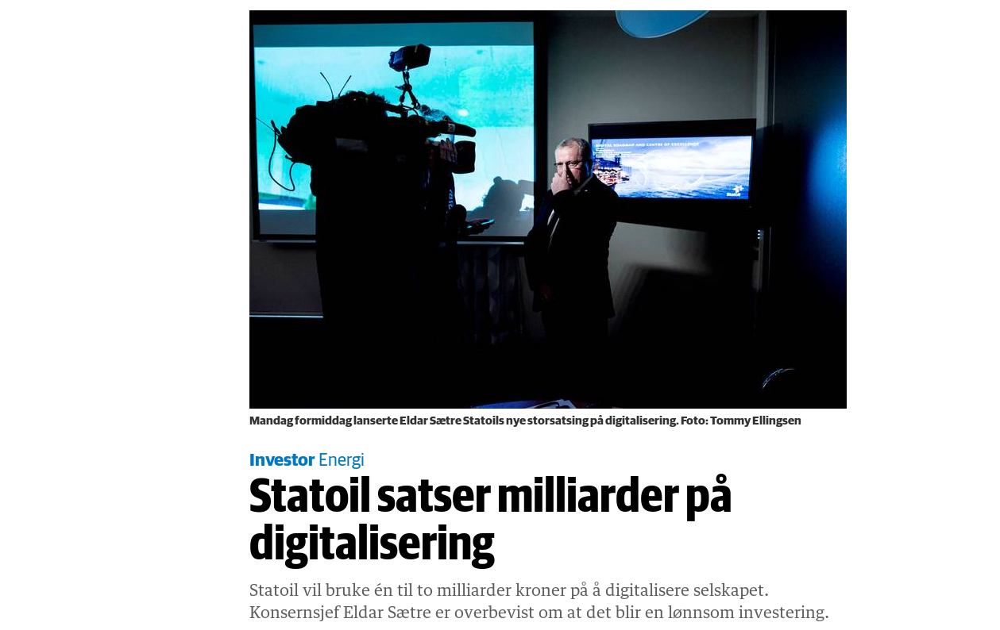

Digital buzz, product development and R&D in Statoil’s mainstream business

---

#### About me:
- Works for Statoil with Data Science "technologies"
- Computer science / developer background
 
---
 

---

## This is good news, but
- Who? |
- How? |

---
## The obvious "who"
- Statoil's Digital Center of Excellence |
- Software Development teams |
- Research & Development in Statoil |
- Cooperation with academia and research institutes |
- Cooperation with commercial partners |

---

## Question: What is missing?

---

## The 15922 remaining employees!
- Everyone will be needed

---

## Example:
- Maintenance of equipment |
- Limited lifetime |
- Premature failures |
- Extended lifetime |

---
### Based on the goals, the path to success will vary!
- Goal 1: Enable experts to keep an eye on important indicators |
- Goal 2: Calculate remaining useful life |
- Goal 3: Automatically order parts and schedule maintenance based on condition |

---
### Based on the goals, the path to success will vary!
---
-Goal 1: Enable experts to keep an eye on important indicators |
 - Agree on common data models, master data, data storage platforms, visualization tools.
---
- Goal 2: Calculate remaining useful life |
 - Could be easy, could be difficult, could be impossible |
---
- Goal 3: Automatically order parts and schedule maintenance based on condition |
 - Depends on a lot of other IT systems, vendors, etc. |
---
# Digitalization is a strategy, not a thing you can buy

---
# (New and unchartered) collaborative constellations is the only way

